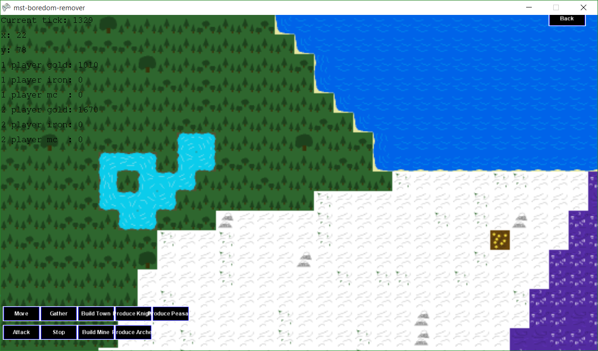
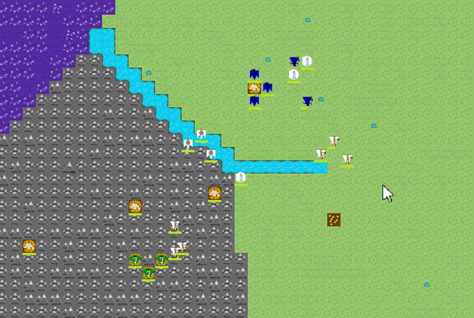

# Warriors XOR Wizards
A Medieval RTS built with the XNA framework for CS4096 at MS&amp;T

The game features large, proceduraly generated maps with rivers and many different biomes, including forests, deserts, and tundras!

Compete against an AI opponent in large-scale combat with smart soldiers which take into account the slowing effect of wading through rivers.

# Compiling
To compile this project you will need to install a version of Visual Studios no earlier than VS 2010.
You will also need to install [Microsoft XNA Game Studio](https://www.microsoft.com/en-us/download/details.aspx?id=23714).
This is easier done on older Visual Studios versions, however it is possible with later version as can be seen [here](https://dementedvice.wordpress.com/2013/10/21/let-me-explain-install-xna-on-visual-studio-2013-and-2012/).

After those things are installed, grab the source code in this repository and open up the solution files.

The project should build, however it will not run without the config.txt file being located in the same directory as the executable, so make sure to copy the config.txt file found in the build directories (mst-boredom-remover/mst-boredom-remover/config.txt) to the same directory as the executable before running it.

